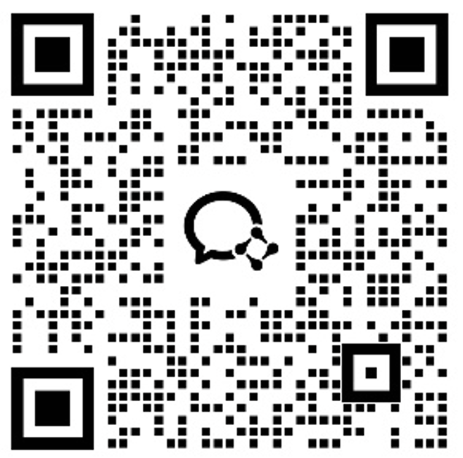

# uMouse SDK · SoniCloud Smart Mouse SDK

Languages: [简体中文](README.md) · **English**

> A **cross-platform, cross-architecture** smart mouse SDK: Windows / macOS / Linux (incl. Chinese domestic systems UOS, Kylin, FangDe) × x86_64 / ARM64, dual-channel USB (HID) & BLE (Bluetooth Low Energy), pure C ABI.

The SoniCloud Smart Mouse SDK is a smart-mouse integration solution for hardware vendors, software developers, and industry integrators: one unified C interface and event protocol covering the full chain of device discovery, connection, and key / event / audio data delivery. This repository provides:

| Resource | Description |
|---|---|
| Platform packages | Windows x64 / macOS ARM64 binary packages (`packages/`, currently 0.4.20); other platform combinations via sales |
| Documentation | English: [docs/Integration-Guide.en.md](docs/Integration-Guide.en.md) · 中文: [docs/第三方接入说明.md](docs/第三方接入说明.md) (both v2.2 — API reference, JSON event protocol, C/C++/C#/Python/Electron integration, FAQ) |
| Header | `include/umouse_sdk.h` — the single public header, pure C ABI |
| Samples | `demo/` (minimal / event printing / multi-device mixed mode, plain C) |
| Notices | `THIRD_PARTY_LICENSES.txt` with accompanying license texts |

## Capabilities

- **Device discovery & connection**: plug-and-play USB 2.4G dongles; BLE scanning with automatic takeover; automatic channel preference (USB first) with runtime switching — device identity (SN) stays stable across channels;
- **Multi-device concurrency**: multiple units of the same model share one rule (4 devices per rule / 8 global by default, configurable); each device gets an independent parsing pipeline;
- **Key events**: speech / translation / M / AI / capture keys with down, up, hold and click actions; unknown key types are passed through as raw key codes (`code`) — **no business mapping is applied**;
- **Discrete events (JSON)**: device info (SN / battery / meeting state), DPI broadcasts, meeting lifecycle with global exclusivity, and a unified warning envelope (pairing broken / device count / BLE link count alerts);
- **Audio output**: built-in SBC / ADPCM decoding delivers PCM (16 kHz / 16-bit / mono), or passes raw encoded blocks through for your own decoder;
- **RAW mode**: integrate hardware with custom protocols — custom handshake, device-matching and SN-extraction callbacks, plus `um_write_raw` for bidirectional passthrough;
- **Diagnostics**: process-level crash recorder (technical data only), internal logging switch, queue-health reporting.

## Platform Support (cross-OS × cross-arch)

| OS | Architecture | USB | BLE | Package |
|---|---|---|---|---|
| Windows 10 / 11 | x64 | ✅ | ✅ | This repo, `packages/` |
| macOS 11+ | arm64 (Apple Silicon) | ✅ | ✅ | This repo, `packages/` |
| UOS (UnionTech) | x86_64 / ARM64 | ✅ | ✅ | Contact sales |
| Kylin | x86_64 / ARM64 | ✅ | ✅ | Contact sales |
| FangDe | x86_64 / ARM64 | ✅ | ✅ | Contact sales |
| Generic Linux | x86_64 | ✅ | ✅ | Contact sales |
| macOS (Intel) | x86_64 | ✅ | ✅ | Contact sales |

> The SDK is cross-platform and cross-architecture **at the source level** (CMake project, Windows / macOS / Linux, built per architecture): the same C ABI and JSON event protocol on every platform, so your integration code never changes per platform; binaries are built per OS × architecture and are not interchangeable. This repository currently ships Windows x64 and macOS ARM64 packages; the remaining combinations are supported as well — contact sales for their packages.

## Repository Layout

```
├── README.md                  This repo's README (Chinese)
├── README.en.md               English README (this file)
├── docs/Integration-Guide.en.md  Full integration documentation, v2.2 (English)
├── docs/第三方接入说明.md       Same documentation in Chinese, v2.2
├── include/umouse_sdk.h       The single public header (pure C ABI)
├── demo/                      C samples (demo.c minimal / demo3.c multi-device)
├── packages/                  Platform packages
│   ├── uMouseSdk_0.4.20_Windows_10-11_x64.zip
│   └── uMouseSdk_0.4.20_macOS_11_arm64.zip
├── img/                       Contact QR code and other assets
├── LICENSE                    MIT License (demo samples)
├── THIRD_PARTY_LICENSES.txt   Third-party notices
├── COPYING.LGPLv2.1           LGPL v2.1 full text (FFmpeg)
└── LICENSE.hidapi-bsd         HIDAPI BSD-3-Clause full text
```

## Quick Start (5 minutes)

Unzip the package for your platform and build the minimal sample `demo/demo.c` at the repository root:

```bat
REM Windows (MSVC developer prompt)
cl /I uMouseSdk\include demo\demo.c /Fe:demo.exe /link /LIBPATH:uMouseSdk uMouseSdk.lib
set PATH=%CD%\uMouseSdk;%PATH%
demo.exe
```

```bash
# macOS
cc -IuMouseSdk/include demo/demo.c -LuMouseSdk -luMouseSdk -o demo && ./demo
```

Core call order: **register callbacks → `um_sdk_init()` → run your business logic → `um_sdk_close()`**.
The SDK faithfully delivers hardware data (key events / JSON discrete events / PCM audio on three
callback lines); what the M key does and how audio gets recognized is entirely up to you. For the
full walkthrough and per-language guides see the [Integration Guide (English)](docs/Integration-Guide.en.md)
or its Chinese original [docs/第三方接入说明.md](docs/第三方接入说明.md).

## Integration Languages

Pure C ABI — callable from mainstream languages with no proprietary runtime:

| Language | How |
|---|---|
| C / C++ | link directly against the header + import library (MSVC / MinGW / clang / gcc) |
| C# (.NET) | P/Invoke, no third-party dependencies |
| Python | standard library ctypes |
| Electron / Node.js | koffi or other FFI libraries |

## Use Cases

- Hardware input for voice input, translation tools and meeting-note productivity software;
- Hardware vendors building on their own protocols (RAW-mode custom integration);
- Industry integrators deploying on Xinchuang (Chinese domestic IT) terminals — UOS / Kylin / FangDe, x86 / ARM64 — with one codebase.

## Hardware & SDK Access

For packages of Chinese domestic OS platforms (UOS / Kylin / FangDe) and other architectures,
hardware specs, evaluation units, the full protocol, a WeChat Work contact QR code, or technical
support materials, contact **SoniCloud** (安徽声云智能科技有限公司):
[sinicloud.com](https://www.sinicloud.com/), open platform [open.sinicloud.com](https://open.sinicloud.com/).
Please mention your target platform, expected volume, and use case.



## Third-Party Components & Licensing

The SDK binaries dynamically link FFmpeg (LGPL-2.1+, shipped as standalone dynamic libraries that
end users may replace) and statically embed HIDAPI (BSD-3-Clause). The macOS package ships a
minimal audio-only FFmpeg build containing no GPL components (build configuration in the package
README). Attribution and obligations are detailed in `THIRD_PARTY_LICENSES.txt` and the
accompanying license texts.

## License & Scope of Use

Sample code under `demo/` is released under the MIT License. SDK binaries, the device's
proprietary protocol, and some documents may contain proprietary content of SoniCloud or its
partners and are not open source as a whole; the commercial scope is governed by the accompanying
notices and the commercial agreement between the parties. The SDK faithfully delivers hardware
data and does not replace application-side responsibilities such as speech recognition or business
mapping. Do not use the proprietary protocol for unauthorized hardware or products.

## Feedback & Issues

Please attach the logs enabled via `um_sdk_init(1)`, your target platform, and the SDK version
(`um_sdk_version()`), then open an issue.

---

*Keywords: smart mouse SDK, mouse SDK, uMouse SDK, SoniCloud, voice mouse, AI mouse, BLE SDK, HID SDK, USB SDK, cross-platform, cross-architecture, Windows, macOS, Linux, ARM64, Xinchuang, UOS, Kylin, FangDe*
